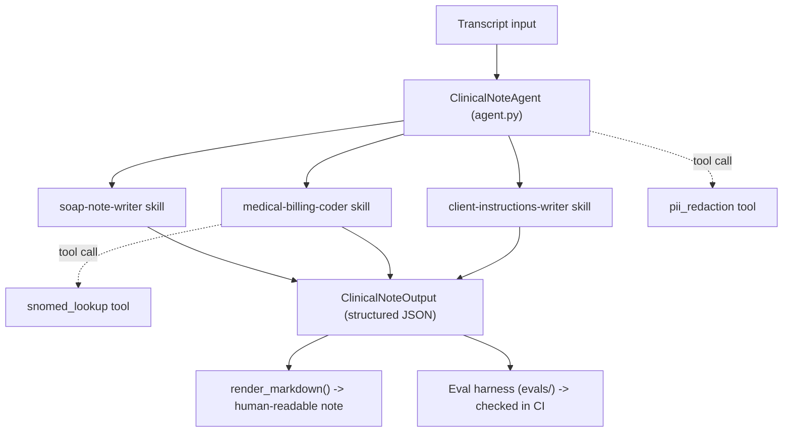

# Clinical Note Taker Agent

An AI agent that turns a veterinary ER encounter transcript into a structured
draft: a SOAP note, candidate SNOMED CT diagnosis codes, follow-up
suggestions, and plain-language instructions for the client (the animal's
owner). Built on the [Claude Agent SDK](https://platform.claude.com/docs/en/agent-sdk/python),
using **skills** (packaged domain instructions), **tools** (narrow function
calls), and an **eval harness** (automated output grading) as first-class
pieces rather than one large prompt.

> [!IMPORTANT]
> **Project status: core pipeline works, but output isn't trustworthy yet.**
> `ClinicalNoteAgent.generate()` produces real, schema-validated notes end to
> end, retrying a missing or schema-invalid submission before giving up. The
> gap is what's *in* them: SNOMED CT codes are unverified and eval coverage
> is minimal. See
> [Known Limitations & Roadmap](#known-limitations--roadmap) before treating
> any generated output as reliable. Also see [Domain Scope &
> Terminology](#domain-scope--terminology): this project targets veterinary
> medicine, not human medicine, and HIPAA does not apply.
>
> See [ROADMAP.md](ROADMAP.md) for the project vision, milestones, and
> where this is headed.

## Table of contents

- [What this is](#what-this-is)
- [Project structure](#project-structure)
- [Architecture](#architecture)
- [Getting started](#getting-started)
- [Usage](#usage)
- [Development workflow](#development-workflow)
- [Configuration](#configuration)
- [Docker](#docker)
- [Domain scope & terminology](#domain-scope--terminology)
- [Known limitations & roadmap](#known-limitations--roadmap)
- [Privacy & compliance](#privacy--compliance)
- [Contributing](#contributing)

## What this is

Three concepts show up throughout this codebase — if you're new to AI
agents, this is the vocabulary you need:

| Concept | What it means here | Where |
|---|---|---|
| **Tool** | A single, narrow function the model can call (like handing it a calculator instead of trusting its memory) | [`src/clinical_note_taker/tools/`](src/clinical_note_taker/tools/) |
| **Skill** | A bundle of instructions for one sub-task, loaded on demand instead of stuffed into one giant prompt | [`src/clinical_note_taker/resources/agent_workspace/.claude/skills/`](src/clinical_note_taker/resources/agent_workspace/.claude/skills/) |
| **Eval** | An automated check of the model's *judgment* against golden test cases — the AI-specific counterpart to a unit test | [`evals/`](evals/) |

## Project structure

```text
clinical-note-taker-agent/
├── src/clinical_note_taker/
│   ├── agent.py            # orchestrator: wires system prompt + tools + skills, calls Claude
│   ├── models.py            # Pydantic schemas — the input/output contract
│   ├── rendering.py         # renders ClinicalNoteOutput -> Markdown (pure function, no LLM call)
│   ├── cli.py                # `clinical-note-taker` command line entry point
│   ├── config.py             # environment-driven settings (see Configuration)
│   ├── tools/
│   │   ├── snomed_lookup.py  # SNOMED CT (vet extension) diagnosis lookup — unverified starter table
│   │   └── pii_redaction.py  # scrubs client PII before anything is logged
│   └── resources/agent_workspace/.claude/skills/
│       ├── soap-note-writer/            # SKILL.md: drafts the SOAP note
│       ├── medical-billing-coder/       # SKILL.md: suggests SNOMED CT codes via snomed_lookup
│       └── client-instructions-writer/  # SKILL.md: writes the owner-facing after-visit summary
├── evals/
│   ├── schema.py         # EvalCase schema
│   ├── run_evals.py       # harness: runs every case, checks deterministic assertions
│   └── cases/*.yaml       # synthetic (never real) encounter transcripts + expected checks
├── tests/                 # pytest unit tests — code correctness, not agent judgment
├── .github/workflows/ci.yml   # lint, typecheck, test, security scan on every PR
├── .pre-commit-config.yaml    # same checks, run locally before you even commit
├── Dockerfile                 # container build
├── pyproject.toml             # dependencies + tool config (ruff, mypy, pytest, bandit)
├── SECURITY.md                # privacy/data-handling notes
└── .env.example                # copy to .env and fill in
```

## Architecture



`agent.py` deliberately disables the Claude Agent SDK's default built-in
tools (file editing, shell access) — this process has no legitimate reason
to touch a filesystem or run commands, so those tools are turned off rather
than merely discouraged in the prompt.

## Getting started

**Prerequisites:**

- Python 3.11+
- [`uv`](https://docs.astral.sh/uv/) — `brew install uv` (macOS) or see the [install docs](https://docs.astral.sh/uv/getting-started/installation/)
- An authenticated Claude Code CLI (`claude login`) or an `ANTHROPIC_API_KEY` — only needed once `agent.py`'s generation logic is implemented; not required to run lint/tests/eval-skip today

```bash
git clone <this-repo-url>
cd clinical-note-taker-agent

uv sync                       # installs runtime + dev dependencies into .venv
cp .env.example .env          # then fill in ANTHROPIC_API_KEY if you have one
pre-commit install            # optional but recommended: runs lint/format on every commit
```

Verify the setup:

```bash
uv run pytest                 # should show 17 passed
uv run clinical-note-taker --help
```

## Usage

```bash
# Write (or use an existing) transcript file, e.g.:
cat > transcript.txt <<'EOF'
Vet: When did you first notice the abdomen looked distended?
Owner: About an hour ago, right after dinner...
EOF

# Structured JSON (default) — matches ClinicalNoteOutput in models.py
uv run clinical-note-taker transcript.txt \
  --encounter-id demo-001 \
  --species canine \
  --visit-type emergency

# Human-readable Markdown instead
uv run clinical-note-taker transcript.txt \
  --encounter-id demo-001 \
  --species canine \
  --format markdown
```

> There's only one command today, so Typer doesn't require (or accept) a
> subcommand name — just `clinical-note-taker <transcript path> [options]`.
> Requires `ANTHROPIC_API_KEY` (or an already-authenticated `claude` CLI) —
> see [Configuration](#configuration).

## Development workflow

| Command | What it does |
|---|---|
| `uv sync` | Install/update dependencies (runtime + dev group) |
| `uv run pytest` | Run the unit test suite |
| `uv run pytest --cov --cov-report=term-missing` | ...with coverage |
| `uv run ruff check .` | Lint |
| `uv run ruff format .` | Auto-format |
| `uv run mypy src` | Type-check |
| `uv run bandit -r src -c pyproject.toml` | Static security scan |
| `uv run --with pip-audit pip-audit` | Dependency vulnerability audit |
| `uv run python -m evals.run_evals` | Run the eval harness against `evals/cases/*.yaml` |
| `pre-commit run --all-files` | Run the same lint/format checks locally, on demand |

All of the above (except the eval harness, which makes real, billed model
calls and needs `ANTHROPIC_API_KEY` — deliberately not run automatically in
CI) run automatically in CI on every pull request —
see [`.github/workflows/ci.yml`](.github/workflows/ci.yml).

## Configuration

Settings are loaded from environment variables (or a `.env` file) with a
`CNT_` prefix — see [`src/clinical_note_taker/config.py`](src/clinical_note_taker/config.py).

| Variable | Default | Description |
|---|---|---|
| `ANTHROPIC_API_KEY` | — | Only needed if the bundled Claude Code CLI isn't already authenticated via `claude login` |
| `CNT_ANTHROPIC_MODEL` | `claude-sonnet-5` | Model used for note generation |
| `CNT_MAX_TURNS` | `8` | Cap on agent turns per encounter, for the whole session (retries share this budget) |
| `CNT_MAX_SUBMISSION_ATTEMPTS` | `2` | How many times to ask the model to (re)submit a note before giving up |
| `CNT_LOG_LEVEL` | `INFO` | Logging verbosity |
| `CNT_REDACT_PII_IN_LOGS` | `true` | Scrub likely client (owner) PII before anything is logged |
| `CNT_REQUIRE_CLINICIAN_REVIEW` | `true` | Tag every generated note as a draft requiring veterinarian sign-off |

## Docker

```bash
docker build -t clinical-note-taker .

docker run --rm \
  -v "$(pwd)/transcript.txt:/data/transcript.txt:ro" \
  --env-file .env \
  clinical-note-taker /data/transcript.txt --encounter-id demo-001 --species canine
```

The image runs as a non-root user and only ships the runtime dependencies
(no dev/lint tooling).

## Domain scope & terminology

This project is scoped to a **veterinary ER** for v1 — not human medicine,
and not any-specialty-yet, even though that's the long-term goal. A few
terms are used precisely and matter for anyone extending this:

- **Patient** = the animal. **Client** = the owner. After-visit instructions
  go to the client (`ClientInstructions` in `models.py`), not the patient.
- **HIPAA does not apply.** HIPAA protects human patient health information;
  animals aren't "individuals" under the statute. What still matters is
  ordinary PII hygiene around the *client* — see [Privacy & Compliance](#privacy--compliance).
- **No ICD-10-CM/CPT equivalent exists for veterinary billing.** Those are
  human-medicine code sets tied to CMS/insurance claims. This project uses
  SNOMED CT's veterinary extension instead (see `tools/snomed_lookup.py`).
- Generalizing to other species/specialties (and potentially a human-medicine
  domain profile with its own HIPAA-aware disclaimers) is a deliberate
  future PR, not attempted here — see the roadmap below.

## Known limitations & roadmap

- **Duplicate-submission handling is a judgment call, not a guarantee.** If
  the model calls `submit_clinical_note` more than once in one turn, the
  *last* call wins — treated as the model revising its own answer (this was
  empirically common in real eval runs, not the rare case it was first
  assumed to be). A missing or schema-invalid submission is retried up to
  `CNT_MAX_SUBMISSION_ATTEMPTS` times before `generate()` raises
  `NoteGenerationError`. Retries share the same `CNT_MAX_TURNS` budget as the
  rest of the session — not yet reconciled or tested for what happens if a
  low `max_turns` is hit mid-retry.
- **SNOMED CT codes are unverified.** `tools/snomed_lookup.py` ships a small,
  hand-picked table of common ER presentations with `concept_id=None` —
  real IDs require registering with the [VTSL browser](https://vtsl.vetmed.vt.edu/)
  or a licensed UMLS feed, neither of which is scrapable. Follow-up: verify
  codes or replace the tool with a live terminology-server/API call.
  `medical-billing-coder`'s `SKILL.md` and `tools/snomed_lookup.py` carry
  the same caveat inline.
- **No LLM-as-judge eval layer yet.** `evals/` currently runs deterministic
  checks only (keyword/code presence, forbidden phrases). A judge pass for
  subjective quality (completeness, tone) is a planned fast-follow, once
  there's real agent output to calibrate a rubric against.
- **Single specialty, single species framing.** The schema, skills, and
  system prompt currently assume "veterinary ER." Multi-specialty/
  multi-species configurability (a "domain profile" concept) is intentionally
  deferred rather than half-built now.

## Privacy & compliance

See [`SECURITY.md`](SECURITY.md) for the full policy. Short version: this
project doesn't claim HIPAA compliance (it doesn't apply to veterinary
patients), but treats client PII and encounter data as sensitive — no real
transcripts belong in this repo, issues, or PRs, and all generated output is
flagged as a draft pending veterinarian review.

## Contributing

- Run `pre-commit install` once, so lint/format issues are caught before
  you commit rather than in CI.
- Keep `SKILL.md` files, `models.py`, and `evals/cases/*.yaml` in sync: the
  schema is the contract, the skills target it, and the eval cases verify it.
- Never commit real client/patient transcripts or output notes — use
  synthetic examples, as in `evals/cases/`.
